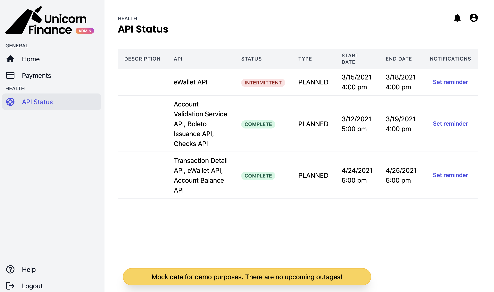

# Demo Wholesale Payments App - Unicorn Finance

We have created Unicorn Finance as a sample application showcasing the capabilities of our the JP Morgan core external APIs. 
We hit a number of JP Morgan APIs in the UAT environment via ssl authentication.

See our project running on codesandbox [here](https://codesandbox.io/s/unicornfinance-msbct)



## What APIs are you hitting?

1. Service Status Page: We hit the Platform Availability Communication Management API on this page. This returns a list of current outages within JP Morgan external APIs. If no outages are returned a message is displayed for the user.
2. Accounts Page: We hit two APIs on this page:
    - Balances: This API returns intraday balances for specific accounts. We use it to get the current day balance for a UAT account
    - Transactions: This API returns all the transactions for a specific account for a specific time period. 

## What's included in this repo?

We have split the codebase into two sections, client and server. 

### Server

This code is written using NodeJS and built upon this [Bulletproof NodeJS structure](https://softwareontheroad.com/ideal-nodejs-project-structure?utm_source=github&utm_medium=readme).
The server is in charge of hitting the JP Morgan APIs, handling authentication (SSL) and caching of data.

#### Structure

    - config: Any configuration such as server port, cache keys etc
    - loaders: The knowledge for starting the server up and populating the data
    - routes: All the routing logic of the application
    - services: Business logic when handling the data from APIs
    
### Client

The client code is written with React and Tailwind CSS. This code takes the data from the server and displays it in a user friendly manner. 
We have a specific readme for Client code [here](TODO)


## Getting started

Make sure to check out our running code on CodeSandbox [here](https://codesandbox.io/s/unicornfinance-msbct).

You can then try out running the code locally. Initially you will run the code hitting mocked data. This is because you need extra authentication information for hitting our actual APIs which is explained below.
    
    1. yarn start
    2. Navigate to localhost:3000
    3. Toggle the mocked data on to see information


### Hitting JP Morgan APIs

This will require you to provide some SSL certificates. 
You will need to onboard to JP Morgan to access this information. Further details are available [here](http://developer.jpmorgan.com/).

Once you have the correct files ready you can upload them to your server (DO NOT COMMIT THESE FILES TO YOUR CODEBASE). 
As we are using codesandbox the information for these files are stored in secret keys. 

#### Using your SSL files

To change the code to use ssl files:

    1. Navigate to [index.js](./server/config/index.js)

    2. Change lines 15 and 16 to resemble:
    
```javascript
// const key = fs.readFileSync(path.join(__dirname, '../unicorns/private.key'));
// const cert = fs.readFileSync(path.join(__dirname, '../unicorns/unicorn.crt'));
```
    3. yarn start
    4. Navigate to localhost: 3000

#### Using env variables

To change the code to use ssl files:

    1. Create a .env file in your root directory
    2. Add two variables 'KEY' and 'CERT' with your ssl details. E.g.

```txt
KEY="MYPRIVATEKEYDETAILS"
CERT="MYCERTDETAILS"
```
    3. yarn start
    4. Navigate to localhost: 3000


## Contribution to our project

We welcome any contributions you have. Please create a PR and we will review it.