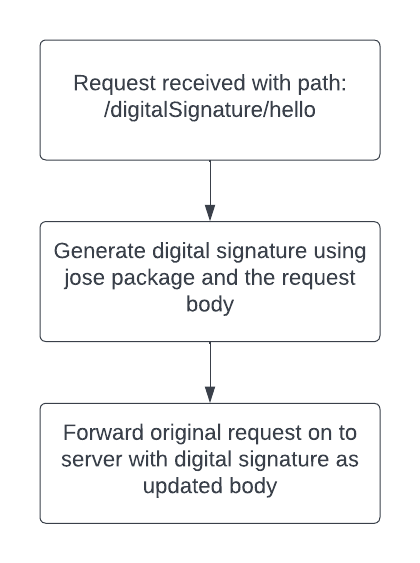

# Unicorn Finance Lambda/API Gateway

Currently we are deploying the backend using Lambda with an API Gateway.

The code is an express server using the http-proxy-middleware package.
The server acts as a proxy between our frontend application and JP Morgan APIs.
Requests are received, we add our TLS details and then forward the request on to the API.

## Types of request

Currently the server has 3 proxies configured, each with slightly different criteria.
The proxy used is determined by the beginning of the request path.

1. /cat/\* - This path takes all requests for JP CAT server
2. /digitalSignature/\* - This path takes any requests that require a digital signature. More information on this is available below.
3. /\* - any request not caught in below paths. This will proxy requests to JP UAT server.

## Digital Signature

For some JP Morgan APIs we need to use a digital signature.
We are using 'jose' nodejs package to generate a digital signature.



## Code overview

The code is in JS using express js.
The code is designed to be ran on an AWS Lambda.
We store our certificates on AWS Secrets manager.

## Running the server

For the server to hit JP Morgan APIs you will need to create a ssl certificate and upload it to developer.jpmorgan.com
Please reach out to your technical implementation manager for further help.

1. Store your certs in a folder that is included in .gitignore (eg. certs)
2. Open server/app.js and check below lines relate to where your certs are

```js
// const httpsOpts = {
//   KEY: fs.readFileSync('../certs/jpmc.key', 'utf-8'),
//   CERT: fs.readFileSync('../certs/jpmc.crt', 'utf-8'),
// };
```

3. Make sure paths on these lines match your folder
4. Then run:

```sh
cd app/server
yarn install
yarn start:local
```

## Deploying a new version

1. Ensure app.js is not looking for local files
2. Run below commands from within this folder

```bash
yarn build
```

3. Log on to AWS lambda service
4. Upload new code
